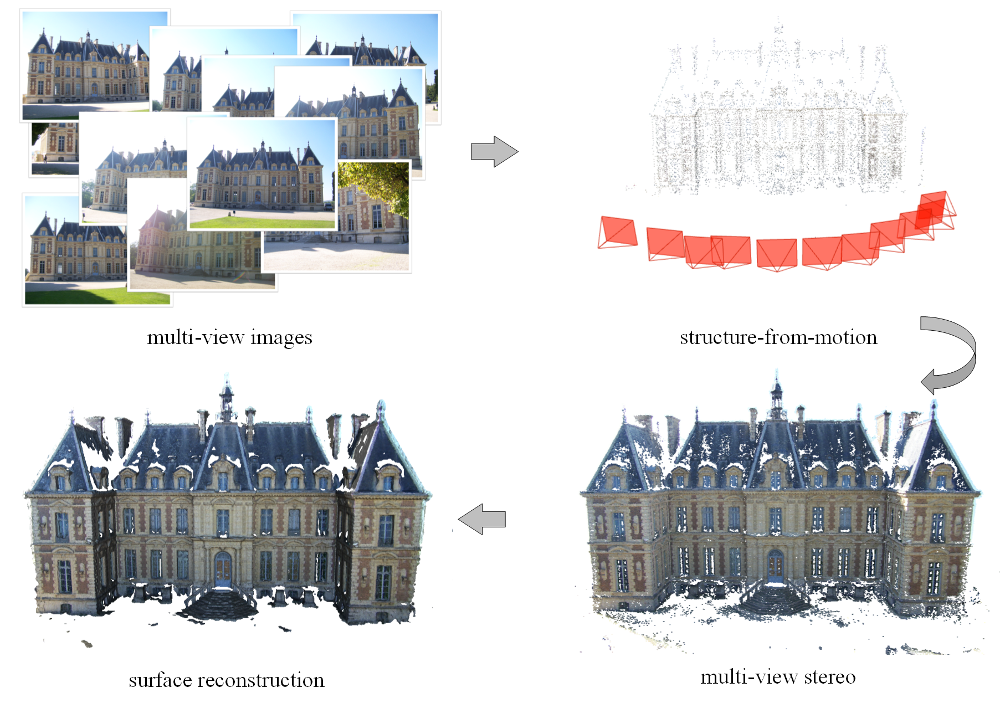

# colmap_3d_recon

This repo includes the following parts:

+ sparse recon using structure-from-motion
+ dense recon using multi-view stereo
+ surface recon using PoissonRecon
+ depth map rendering using pyrender (if you want to get the depth map for learning-based multi-view stereo)