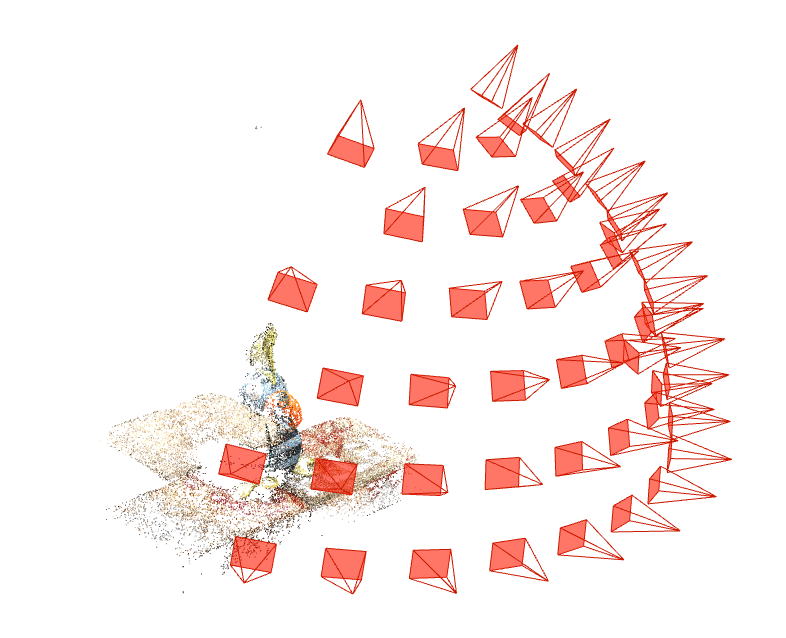
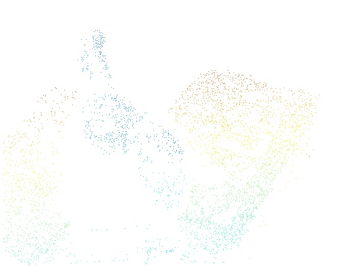
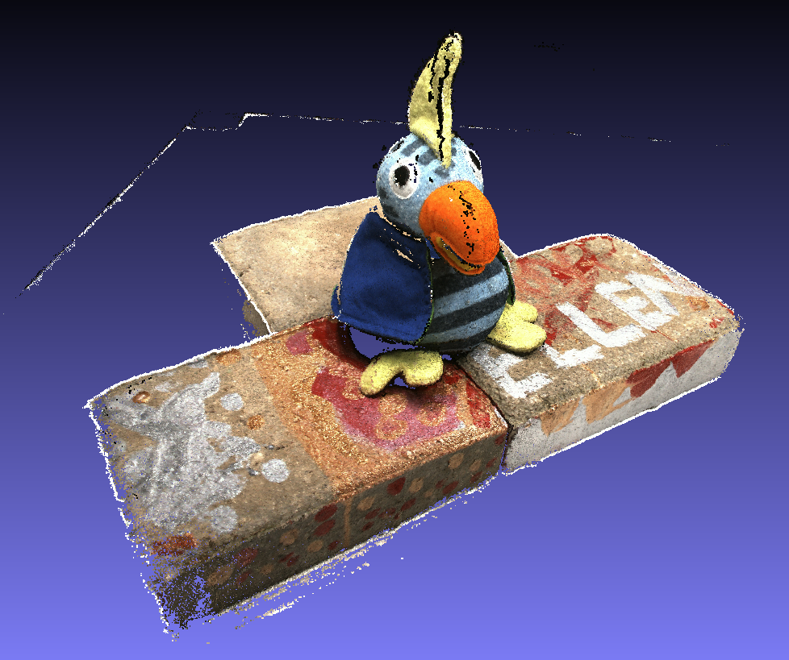

# colmap_sparse_recon

Sturcture-from-Motion using [COLMAP](https://colmap.github.io/index.html)

* input: unordered images
* outputs: the pose estimates for registered images and the reconstructed scene structure as a set of points

## How to use
1. prepare data and build colmap
   + Download the [original data](https://roboimagedata.compute.dtu.dk/?page_id=36) provided by DTU or the [preprocessed data](https://github.com/YoYo000/MVSNet#download) by MVSNet (Yao et al.)
   + Build [colmap](https://github.com/colmap/colmap/tree/3.6) (we use the version 3.6, the other versions should be OK)
   + modify the `dataset_path`, `colmap_exe_path` in `colmap_sparse_recon.py` or `colmap_sparse_recon_posed.py`

2. sparse reconstruction using colmap
   + For DTU (images with known camera poses)
     `python colmap_sparse_recon_posed.py`. 
     You can download the triangulated sparse point cloud for DTU via OneDrive or [BaiduNetDisk](https://pan.baidu.com/s/1FOtDwFgo8CZzNn1_PTBjjw), Fetch Code: `3puk`
     
   + For Tanks and Temples training set
     `python colmap_sparse_recon.py`
     
   + the results of the sparse reconstruction cloud be represented as `cameras.bin`, `images.bin` and `points3D.bin`

3. convert sparse points to sparse depth map
   `python colmap_sparse_to_depth.py`, the sparse depth map is saved as `pfm` file

## Visualization
1. Visualize the sparse points
   + Use COLMAP GUI --> File --> Import model --> Select the sparse folder which contains cameras, images and points3D files (.bin/.txt)

2. Visualize the sparse depth map
   + `python visualize_sparse.py xxx.pfm`

 <table align="center">
  <tr>
    <td></td>
    <td></td>
  </tr>
  <tr>
    <td>RGB image</td>
    <td>structure-from-motion</td>
  </tr>  <tr>
    <td></td>
    <td></td>
  </tr>
  <tr>
    <td>sparse depth map</td>
    <td>dense point cloud</td>
  </tr>
</table>

## Acknowledgement
   + The image set of [SceauxCastle](https://github.com/openMVG/ImageDataset_SceauxCastle) is provided by the author of OpenMVG.
