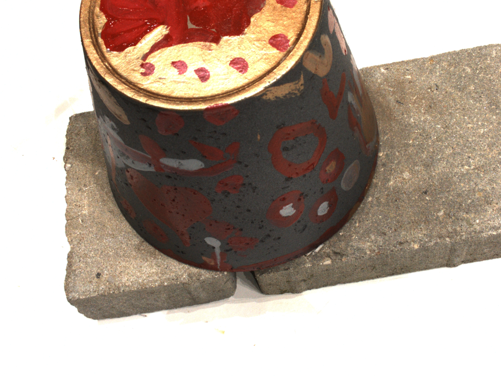
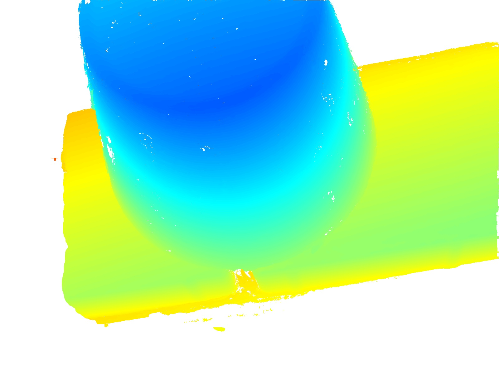
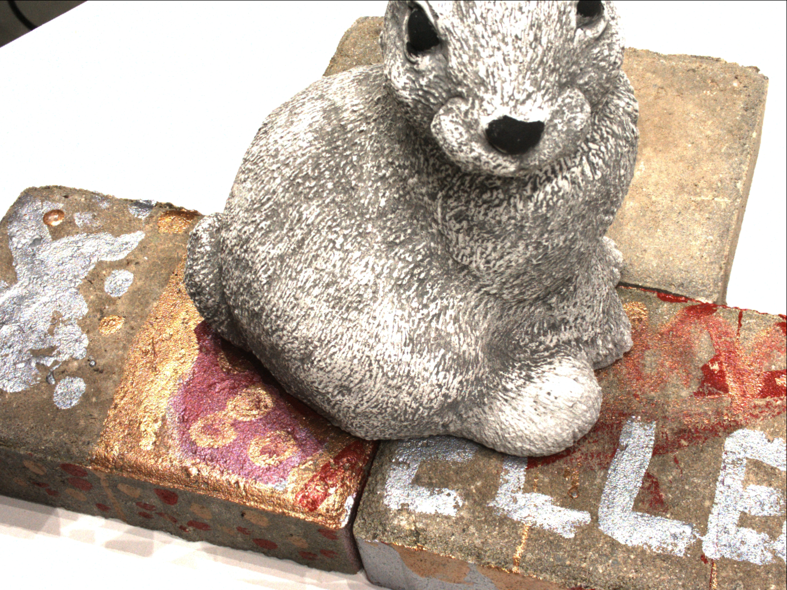
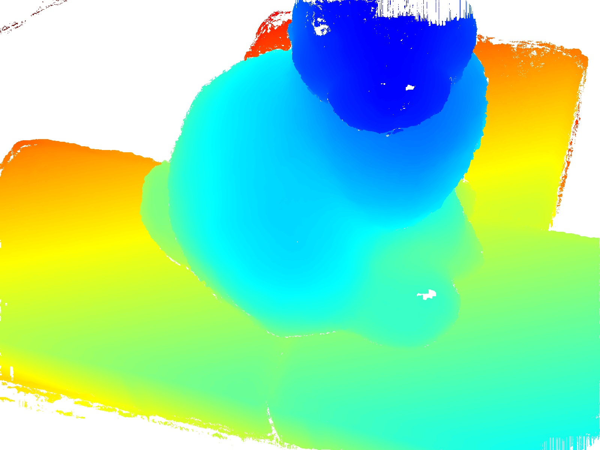

# colmap_dense_recon

Visualize the depth map generated by colmap

​	`python visualize_dense.py xxx.bin`


 <table align="center">
  <tr>
    <td></td>
    <td></td>
  </tr> 
  <tr>
    <td></td>
    <td></td>
  </tr>
  <tr>
    <td>RGB images</td>
    <td>colmap depths (geometric)</td>
  </tr>
</table>

```
colmap_eval_results
>> acc = mean(BaseStat.MeanData)
acc =
    0.4012
>> comp = mean(BaseStat.MeanStl)
comp =
    0.6608
>> overall = (acc + comp)/2
overall =
    0.5310
```
