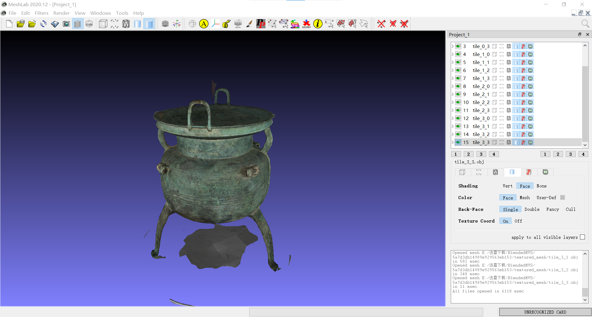
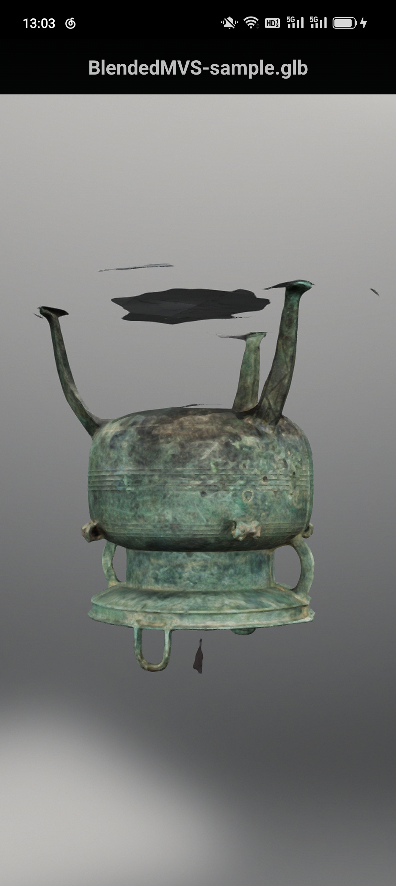

### **移动端3D模型显示**

PC端显示（Meshlab）：

移动端显示：

**格式转换**：PLY-->OBJ-->glTF2.0 (.glb文件)

**安卓APK下载**：filament-gltf-viewer-xxx-android.apk [Releases · google/filament (github.com)](https://github.com/google/filament/releases)

**参考资料**:
+ obj转glb: https://github.khronos.org/glTF-Tutorials/BlenderGltfConverter/

