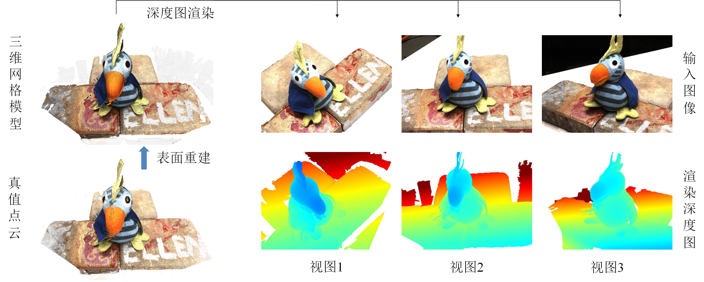

# pyrender_mesh_to_depth

**深度图渲染：**

**参考链接：**

+ [Pyrender Quickstart](https://pyrender.readthedocs.io/en/latest/examples/quickstart.html)
  + Minimal Example for 3D Viewer
  + Minimal Example for Offscreen Rendering
+ [How to render the triangle mesh to depthmap in different views? · Issue #2 · JiayuYANG/Self-supervised-CVP-MVSNet (github.com)](https://github.com/JiayuYANG/Self-supervised-CVP-MVSNet/issues/2)
+ https://github.com/colmap/colmap/issues/704#issuecomment-954161261